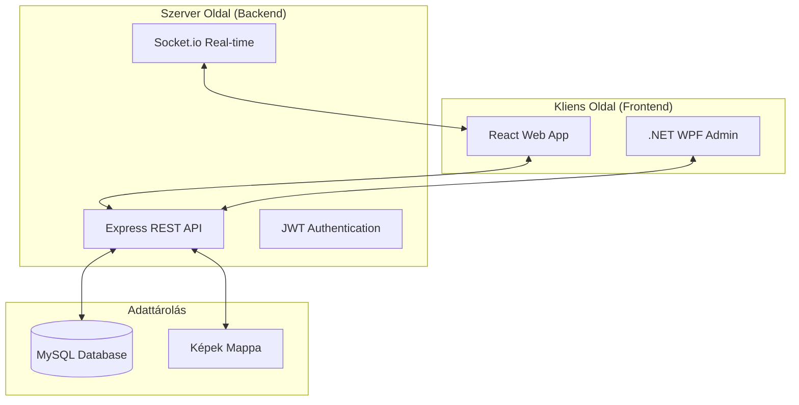

# AjándékAjánló - Komplex Ajándékkereső és Közösségi Platform

Az **AjándékAjánló** egy modern, teljes körű szoftvermegoldás, amely az ajándékválasztás nehézségeire kínál innovatív választ. A projekt egy reszponzív webalkalmazásból, egy robusztus REST API-ból és egy asztali (WPF) adminisztrációs felületből áll.

## 🌟 Főbb Funkciók

### 1. Intelligens Ajándékkereső
- **Többszintű szűrés**: Árintervallum (dinamikus csúszkával), alkalom, stílus és célcsoport alapján.
- **Kategóriák**: Különválasztott élmény- és tárgyalapú ajándékok.
- **Kedvencek és Előzmények**: A felhasználók elmenthetik a tetsző ajándékokat, és visszanézhetik korábbi kereséseiket.

### 2. Közösségi Modul
- **Valós idejű Chat**: Élő üzenetváltás a barátok között Socket.io technológiával.
- **Barát-meghívó rendszer**: Ismerősök meghívása emailben, egyedi regisztrációs linkkel.
- **Értesítések**: Azonnali rendszerüzenetek új csevegésről vagy sikeres meghívásról.

### 3. Jutalmazási Rendszer
- **Automatikus Kuponok**: Sikeres meghívás után (ha a barát regisztrál) mindkét fél egyedi kuponkódot kap.
- **Üzleti logika**: A kuponok 5.000 Ft kedvezményt biztosítanak legalább 15.000 Ft értékű vásárlás esetén.
- **Kuponkezelés**: A kódok a profil menüben bármikor megtekinthetőek és kimásolhatóak.

### 4. Adminisztráció (WPF)
- Teljes körű CRUD műveletek az ajándékok felett.
- Felhasználói adatok kezelése és moderálása.
- Képfeltöltési lehetőség az ajándékokhoz.

---

## 🛠 Technológiai Stack

| Réteg | Technológiák |
| :--- | :--- |
| **Frontend** | React 18, TypeScript, Vite, Tailwind CSS, React Router |
| **Backend** | Node.js, Express, Sequelize ORM, Socket.io, JWT |
| **Adatbázis** | MySQL (3. normálforma, tranzakciókezelés, indexelés) |
| **Desktop** | C# .NET, WPF (MVVM minta), HttpClient |
| **Dokumentáció** | Swagger (OpenAPI 3.0) |

---

## 📐 Rendszerarchitektúra



---

## 🚀 Telepítés és Indítás

### 1. Előfeltételek
- Node.js (v18 vagy újabb)
- MySQL szerver (pl. XAMPP vagy MySQL Installer)
- Git

### 2. Backend (Api mappa) beállítása
```bash
cd Api
npm install
```
Hozzon létre egy `.env` fájlt az alábbi tartalommal:
```env
DB_HOST=localhost
DB_USER=root
DB_PASSWORD=
DB_NAME=vizsgaremek
JWT_SECRET=your_super_secret_key
EMAIL_USER=ajandekajanlovizsgaremek@gmail.com
EMAIL_PASS=your_app_password
FRONTEND_URL=http://localhost:5173
```
Adatbázis inicializálása:
```bash
npx sequelize-cli db:create
npx sequelize-cli db:migrate
npx sequelize-cli db:seed:all
```
Szerver indítása:
```bash
node server.js
```

### 3. Frontend (my-react-app mappa) beállítása
```bash
cd my-react-app
npm install
npm run dev
```
Az alkalmazás elérhető: `http://localhost:5173`

---

## 📖 API Dokumentáció
A projekt teljes körűen dokumentált API-val rendelkezik. A szerver futása közben az alábbi címen érhető el az interaktív felület:
👉 **[http://localhost:3000/api-docs](http://localhost:3000/api-docs)**

---

## 🔒 Biztonsági Megoldások
- **Jelszóvédelem**: A jelszavakat **bcrypt** algoritmussal hashelve tároljuk.
- **Munkamenet-kezelés**: JWT alapú azonosítás, fül-független `sessionStorage` tárolással (lehetővé teszi több felhasználó egyidejű belépését ugyanazon a böngészőn belül).
- **Adatintegritás**: A kritikus folyamatok (pl. regisztráció + kupon generálás) SQL **tranzakciókban** futnak.

---

## 👥 Készítők
- **Gebhardt Lilla**
- **Détári Viktória**

---
*Ez a projekt a Ceglédi SZC Közgazdasági és Informatikai Technikum szoftverfejlesztő vizsgaremekeként készült.*
